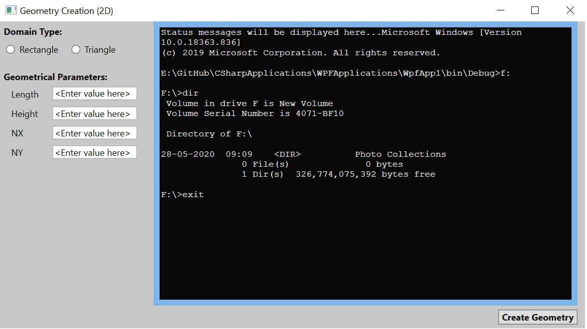

# WPF Application creation
This project is to demonstrate how to create a simple windows application using WPF (C#).

# Application
Create geometry by getting user inputs

# Pre-requistite(s):
VS2019 (With WPF installed)

#Refer (for installation guidance): 
https://docs.microsoft.com/en-us/visualstudio/ide/step-1-create-a-windows-forms-application-project?view=vs-2019

# Directions to explore:
1. Clone this repository in your local machine.
2. Double click on the "WpfApp1.sln" and open in Visual Studio.
3. Start exploring files "MainWindow.xaml" [Design view] and double click over button (in design) to view source code (.xaml.cs).

# Snapshot

