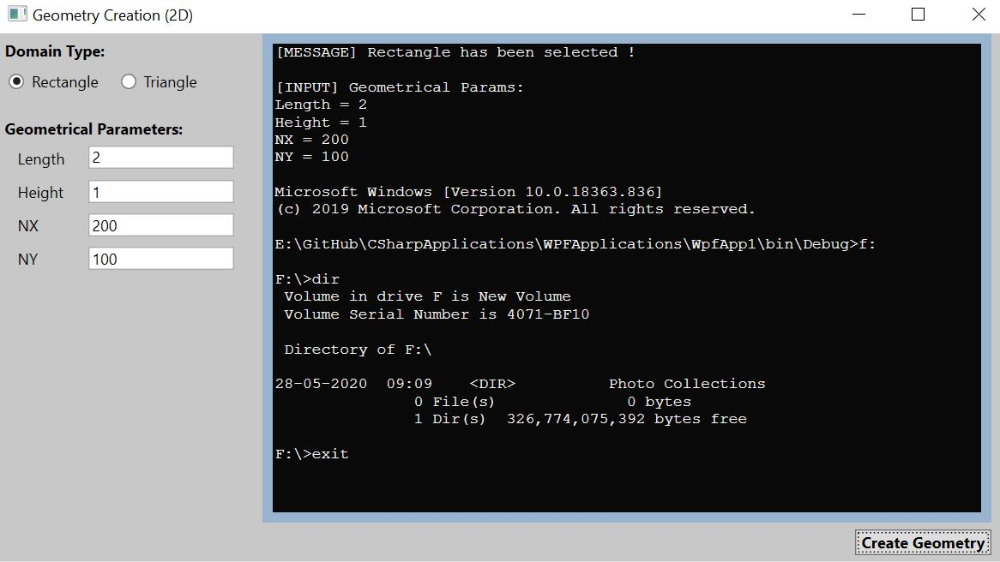

# LaunchCmd
This project is to demonstrate how to create a simple Windows Form application (using C#).

# Application
Launch Command, execute script and redirect output to newly created application.

# Pre-requistite(s):
VS2019 (With Windows form installed)

##Refer: 
https://docs.microsoft.com/en-us/visualstudio/ide/step-1-create-a-windows-forms-application-project?view=vs-2019

# Directions to explore:
1. Clone this repository in your local machine.
2. Double click on the "LaunchCmd.sln" and open in Visual Studio.
3. Start exploring files "Form1.cs" [Design view] and double click over button (in design) to view source code.

# Snapshot

